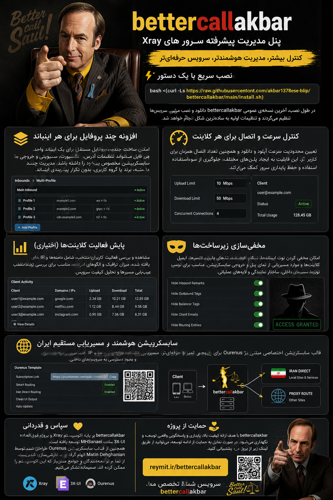
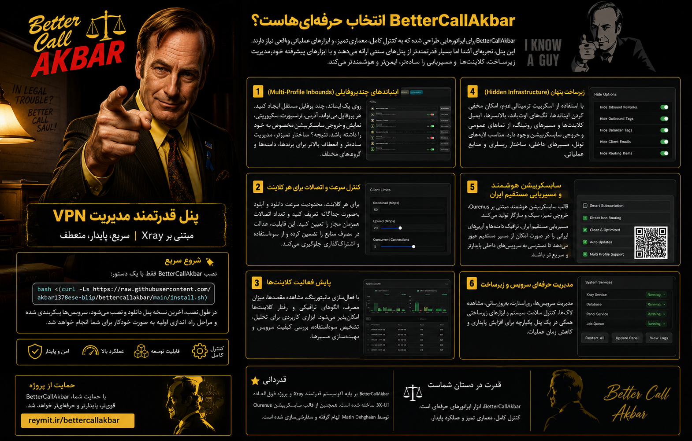

# bettercallakbar

<p align="center">
	
</p>

<p align="center">
	
</p>

## ⚡ نصب سریع

نصب **bettercallakbar** تنها با یک دستور:

```bash
bash <(curl -Ls https://raw.githubusercontent.com/akbar1378ese-blip/bettercallakbar/main/install.sh)
```

در فرآیند نصب، آخرین پکیج انتشار عمومی دانلود می‌شود، پنل نصب می‌گردد، سرویس سیستم‌عامل پیکربندی می‌شود و تنظیمات اولیه به‌صورت تعاملی انجام می‌گیرد.

---

## ✨ تفاوت‌های کلیدی bettercallakbar

**bettercallakbar** یک پنل مدیریت پیشرفته مبتنی بر اکوسیستم Xray است که برای اپراتورهایی طراحی شده که به کنترل دقیق‌تر، مدیریت چندپروفایلی، محدودیت‌های سطح کلاینت و دید عملیاتی بالاتر نیاز دارند.

این پنل تجربه آشنای 3X-UI را حفظ کرده و در عین حال ابزارهای عملیاتی واقعی برای محیط‌های پرتردد و چندکاربره اضافه کرده است:

- Multi-Profile Inbounds
- محدودیت سرعت و تعداد اتصال همزمان در سطح هر کلاینت
- مانیتورینگ فعالیت کلاینت‌ها
- Hidden Infrastructure
- Smart Subscription با پشتیبانی از Iran Direct Routing

هدف اصلی، افزایش انعطاف‌پذیری عملیاتی بدون پیچیده‌سازی غیرضروری پنل است.

---

## 🧩 Multi-Profile Inbounds

قابلیت **Multi-Profile Inbounds** امکان تعریف چندین پروفایل اشتراک مستقل روی یک اینباند واحد را فراهم می‌کند، بدون نیاز به تکرار کامل کانفیگ اینباند.

هر پروفایل می‌تواند به‌صورت مستقل تنظیمات زیر را داشته باشد:

- آدرس و دامنه
- نوع Transport
- حالت Security
- رفتار نمایش در Subscription
- خروجی نهایی لینک اشتراک

این ساختار برای مدیریت همزمان چند دامنه، چند برند، گروه‌های کاربری مختلف یا استراتژی‌های مسیریابی متفاوت بسیار کارآمد است و از ایجاد اینباندهای تکراری جلوگیری می‌کند.

---

## 🚦 محدودیت سرعت و تعداد اتصال همزمان در سطح کلاینت

در bettercallakbar امکان تعریف محدودیت سرعت آپلود و دانلود به‌صورت جداگانه برای هر کلاینت وجود دارد. همچنین می‌توان تعداد اتصالات همزمان مجاز برای هر کلاینت را محدود کرد.

برخلاف محدودیت ترافیک کلی (Quota)، این قابلیت رفتار سرعت واقعی کلاینت را کنترل می‌کند و برای موارد زیر بسیار کاربردی است:

- ایجاد پلن‌های خدماتی با سطوح سرعت مختلف
- اعمال سیاست Fair Usage
- جلوگیری از مصرف بیش از حد منابع سرور توسط کاربران سنگین
- کاهش اشتراک‌گذاری حساب (Account Sharing)

این کنترل‌ها پایداری سرویس را در محیط‌های پر کاربر به‌طور محسوسی افزایش می‌دهد.

---

## 📊 Client Activity Monitoring

قابلیت **مانیتورینگ فعالیت کلاینت** امکان مشاهده رفتار ترافیکی کلاینت‌های انتخاب‌شده را فراهم می‌کند.

با فعال‌سازی این ویژگی می‌توان موارد زیر را بررسی کرد:

- مقاصد مشاهده‌شده
- میزان مصرف ترافیک
- الگوهای فعالیت

این ابزار برای بررسی سوءاستفاده، عیب‌یابی مسیریابی، کنترل کیفیت سرویس و تحلیل جریان ترافیک بسیار مفید است و بدون ایجاد بار اضافی روی پنل طراحی شده است.

---

## 🕶️ Hidden Infrastructure

از طریق اسکریپت ترمینال `y-ui` می‌توان بخش‌های داخلی زیرساخت را بدون تغییر در رفتار واقعی سیستم مخفی کرد.

موارد قابل مخفی‌سازی شامل:

- Remark اینباندها
- تگ اوت‌باندها
- تگ بالانسرها
- ایمیل کلاینت‌ها
- ورودی‌های مربوط به Routing

این قابلیت برای لایه‌های تونل، مسیرهای داخلی، سرویس‌های بک‌اند و ساختارهای ریسلری بسیار کاربردی است. آیتم‌های مخفی همچنان در پس‌زمینه به‌درستی کار می‌کنند، اما در نمای پنل و خروجی اشتراک دیده نمی‌شوند.

---

## 🧭 Smart Subscription Links و Iran Direct Routing

خروجی اشتراک‌ها بر پایه قالب سفارشی‌شده **Ourenus** تولید می‌شود و تجربه کلاینت را تمیزتر و کاربردی‌تر می‌کند.

قابلیت **Iran Direct Routing** مسیرهای اختصاصی برای دامنه‌ها و رنج‌های IP ایرانی اضافه می‌کند. در نتیجه ترافیک داخلی (سایت‌های ایرانی، بانک‌ها، اپلیکیشن‌های داخلی و منابع محلی) به‌جای عبور از پروکسی، به‌صورت مستقیم مسیریابی می‌شود.

**مزایا:**

- کاهش بار غیرضروری روی پروکسی
- بهبود دسترسی به سرویس‌های داخلی
- پروفایل‌های کلاینت روان‌تر برای کاربران ایرانی

---

## 🙏 اعتبارات

**bettercallakbar** بر پایه اکوسیستم Xray ساخته شده و از پروژه عالی [3X-UI](https://github.com/MHSanaei/3x-ui/) توسعه یافته توسط MHSanaei الهام گرفته است.

همچنین از قالب اشتراک [Ourenus](https://github.com/MatinDehghanian/Ourenus) ساخته‌شده توسط Matin Dehghanian استفاده و سفارشی‌سازی شده است.

از تمام پروژه‌ها، توسعه‌دهندگان و جامعه متن‌باز که این اکوسیستم را ممکن ساخته‌اند سپاسگزاریم.

---

## 💛 حمایت از پروژه

اگر این پروژه برای شما مفید بوده و مایلید از توسعه مستمر آن حمایت کنید:

[حمایت مالی از bettercallakbar](https://reymit.ir/bettercallakbar)

حمایت شما به ادامه توسعه، پایداری و افزودن قابلیت‌های جدید کمک می‌کند.

